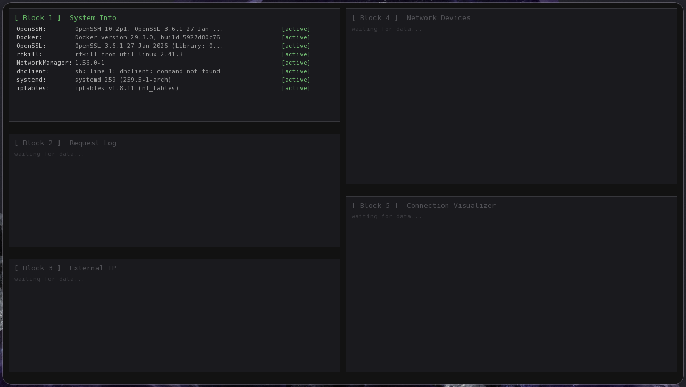

# NetPulse Monitor


A real-time network monitoring dashboard for Linux, built with SFML.  
Visualizes active connections, network devices, HTTP traffic, system tool versions and external IP info - all in one graphical interface.

> ⚠️ Requires root privileges (`sudo`) - needed for packet capture via libpcap.

---

## Preview




---

## Features

| Block | Description |
|---|---|
| System Info | Versions and status of: OpenSSH, Docker, OpenSSL, NetworkManager, systemd, iptables and more |
| Request Log | Live HTTP request capture via libpcap - method, path, source IP, timestamp |
| External IP | Your public IP, ISP and location via HTTPS API |
| Network Devices | All devices visible in ARP table - IP, MAC, interface |
| Connection Visualizer | Animated graph of active TCP/UDP connections with status colors |

---

## Dependencies

| Library | Purpose | Install (Arch) |
|---|---|---|
| SFML 3.x | Graphics, window, events | `sudo pacman -S sfml` |
| libcurl | HTTPS requests to IP APIs | `sudo pacman -S curl` |
| libpcap | Packet capture | `sudo pacman -S libpcap` |
| xorg-xhost | Allow root to access display | `sudo pacman -S xorg-xhost` |

**Build tools:**
```bash
sudo pacman -S cmake clang make
```

---

## Build & Run

```bash
# Clone
git clone https://github.com/trapplus/NetPulse-Monitor.git
cd NetPulse-Monitor

# Build
make build

# Run (requires root + display access)
make run
```

`make run` automatically calls `xhost +local:` before launching with `sudo -E`.

### Manual build

```bash
mkdir build && cd build
cmake .. -DCMAKE_BUILD_TYPE=Debug
cmake --build build -j$(nproc)
xhost +local:
sudo -E ./build/NetPulseMonitor
```

### Available make targets

| Command | Description |
|---|---|
| `make build` | Configure and compile |
| `make run` | Build and run |
| `make clean` | Remove build directory |

---

## Project Structure

```
NetPulse-Monitor/
├── CMakeLists.txt
├── Makefile
├── include/          # All headers (.hpp)
│   ├── App/
│   ├── Data/
│   ├── Render/
│   └── Utils/
├── src/              # All sources (.cpp)
│   ├── App/
│   ├── Data/
│   ├── Render/
│   └── Utils/
└── assets/fonts/
```

---

## Roadmap

| Milestone | Status |
|---|---|
| M1 - CMake + dependencies | ✅ |
| M2 - Root check + SFML window | ✅ |
| M3 - Block 1: System Info | ⬜ |
| M4 - Block 4: Network Devices | ⬜ |
| M5 - Block 5: Connection Visualizer | ⬜ |
| M6 - Block 3: External IP | ⬜ |
| M7 - Block 2: Packet Sniffer | ⬜ |
| M8 - UI polish, animations | ⬜ |
| M9 - Docs, demo | ⬜ |

---

## Author

**trapplus** - college systems programming project, 2026
